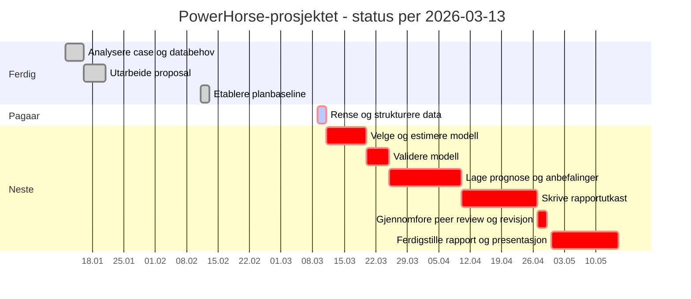

# Status for PowerHorse-prosjektet

Statusdato: 2026-03-13

Denne statusen er basert pa planbaseline og aktivitetsstatus i `project-plan.md`, `schedule.json` og `wbs.json`.

## Kort status

- Prosjektet er i fase 3 - gjennomforing.
- Fase 1 og fase 2 er ferdigstilt som planlagt.
- Aktiviteten `Rense og strukturere data` er startet, men star fortsatt som `in-progress` med 25 % ferdigstillelse.
- Etter opprinnelig plan skulle `Rense og strukturere data` vaert ferdig 2026-03-11. Per 2026-03-13 framstar derfor prosjektet som noe bak baseline.
- Neste aktivitet i kritisk linje er `Velge og estimere modell`, etterfulgt av `Validere modell`.

## Gjennomfort

| Aktivitet | Periode | Status |
| --- | --- | --- |
| Analysere case og databehov | 2026-01-12 til 2026-01-16 | Ferdig |
| Utarbeide proposal | 2026-01-16 til 2026-01-21 | Ferdig |
| Etablere planbaseline | 2026-02-11 til 2026-02-13 | Ferdig |

## Pagaaende

| Aktivitet | Planlagt periode | Status | Kommentar |
| --- | --- | --- | --- |
| Rense og strukturere data | 2026-03-09 til 2026-03-11 | Pagaar, 25 % | Over planlagt sluttdato og bor fullfores for modellarbeidet kan starte |

## Neste aktiviteter

| Prioritet | Aktivitet | Planlagt periode | Avhengighet |
| --- | --- | --- | --- |
| 1 | Velge og estimere modell | 2026-03-11 til 2026-03-20 | Etter datarensing |
| 2 | Validere modell | 2026-03-20 til 2026-03-25 | Etter modellvalg |
| 3 | Lage prognose og anbefalinger | 2026-03-25 til 2026-04-10 | Etter modellvalidering |
| 4 | Skrive rapportutkast | 2026-04-10 til 2026-04-27 | Etter prognosearbeid |
| 5 | Gjennomfore peer review og revisjon | 2026-04-27 til 2026-04-29 | Etter rapportutkast |
| 6 | Ferdigstille rapport og presentasjon | 2026-04-30 til 2026-05-15 | Etter peer review |

## Milepaeler

| Milepael | Dato | Status |
| --- | --- | --- |
| Case og problemstilling avklart | 2026-01-12 | Oppnadd |
| Godkjent proposal | 2026-01-21 | Oppnadd |
| Godkjent plan | 2026-02-13 | Oppnadd |
| Forste analyseutkast | 2026-03-11 | Ikke oppnadd enn |
| Hovedutkast klart for review | 2026-04-27 | Planlagt |
| Peer review gjennomfort | 2026-04-29 | Planlagt |
| Endelig innlevering og presentasjon | 2026-05-15 | Planlagt |

## Gantt-status

## Vurdering

Prosjektet har fullfort initiering og planlegging, men ligger per 2026-03-13 etter opprinnelig baseline i starten av fase 3. Det viktigste na er a lukke datarensing og strukturering raskt, fordi hele den kritiske linjen videre avhenger av dette arbeidet.
